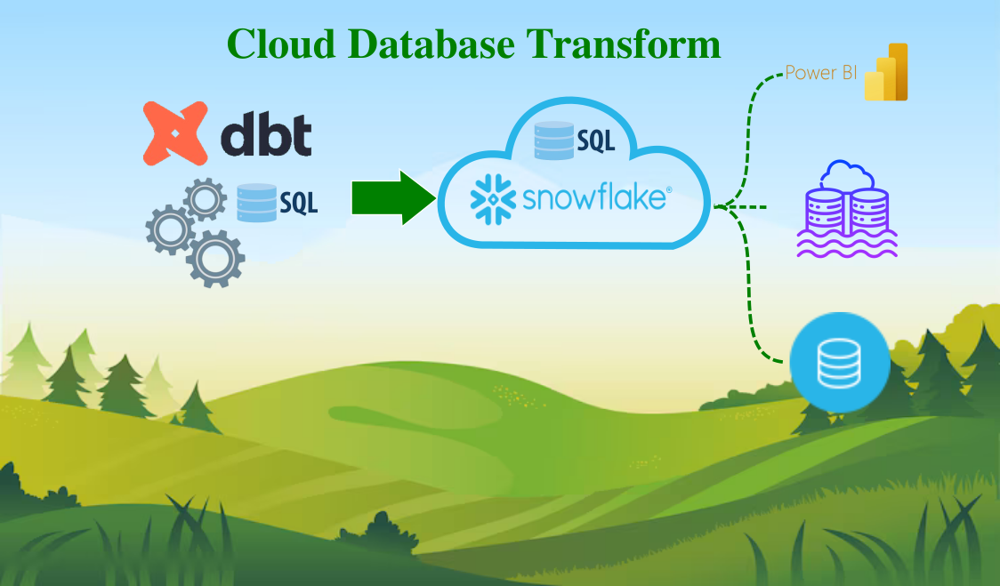
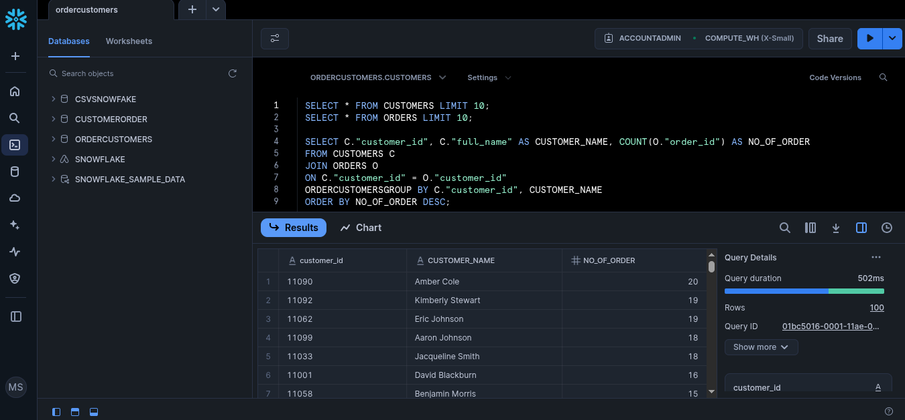
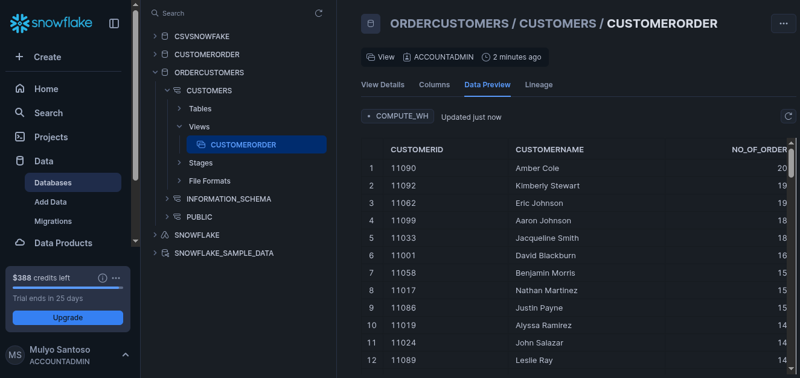

# dbt_on_snowflake

# *Overview*
Project repo to demonstrate data transformation on Snowflake datawarehouse using DBT. Create models on DBT to query view on Snowflake. This project to demonstrate how to DBT use as data transformation tool on Snowflake.
# *Prerequisites*
To follow along this project need to available on your system:
- Snowflake account with datawarehouse, database, schema ready
- DBT running on system
  ```bash
  # dbt initialization
  dbt init
  ....
  fillin all query
  snowflake project:
  datawarehouse:
  database:
  schema:
  password: 
  ....

  # checking connection
  dbt debug
  ```
# *Project Flow*
Data Transformation on Snowflake cloud database with dbt:
1. SQL query on Snowflake test
   
2. Write SQL on dbt model
   ```SQL
   WITH CUSTOMERORDER AS(
   SELECT C."customer_id" AS CUSTOMERID, C."full_name" AS CUSTOMERNAME, COUNT(O."order_id") AS NO_OF_ORDER
   FROM CUSTOMERS C
   JOIN ORDERS O ON C."customer_id"=O."customer_id"
   GROUP BY C."customer_id", CUSTOMERNAME
   ORDER BY NO_OF_ORDER DESC
   )

   SELECT CUSTOMERID, CUSTOMERNAME, NO_OF_ORDER
   FROM CUSTOMERORDER
   ```
3. Run dbt
   ```bash
   dbt run
   ```
4. Error correction if exist
5. Checking result on Snowflake database
   
